# UART Communication System in Verilog

## Overview

A parameterized UART (Universal Asynchronous Receiver/Transmitter) communication system designed in Verilog HDL.

The project includes a configurable baud generator, UART transmitter, UART receiver, top-level integration, and a comprehensive verification testbench.

---

## Features

- Parameterized Clock Frequency
- Parameterized Baud Rate
- Baud Tick Generator
- UART Transmitter (TX)
- UART Receiver (RX)
- Top-Level UART Integration
- Busy Signal
- Done Signal
- Framing Error Detection
- Parity Error Detection
- Self-checking Testbench
- Multiple Verification Scenarios

---

## Project Structure

UART-Communication-System-Verilog │ ├── rtl/ │ ├── baud_generator.v │ ├── uart_tx.v │ ├── uart_rx.v │ └── uart_top.v │ ├── testbench/ │ └── uart_tb.v │ ├── docs/ │ ├── architecture/ │ │ ├── baud_generator.png │ │ ├── uart_top_architecture.png │ │ ├── uart_tx_architecture.png │ │ ├── uart_rx_architecture.png │ │ ├── uart_tx_fsm.png │ │ └── uart_rx_fsm.png │ │ │ ├── simulation/ │ │ ├── basic_communication.png │ │ ├── busy_signal.png │ │ ├── back_to_back.png │ │ ├── random_stress_test.png │ │ ├── uart_waveform_full.png │ │ ├── uart_waveform_zoom.png │ │ └── verification_summary.png │ │ │ └── reports/ │ └── verification_results.txt │ ├── README.md

---

# System Architecture

## Top-Level Architecture

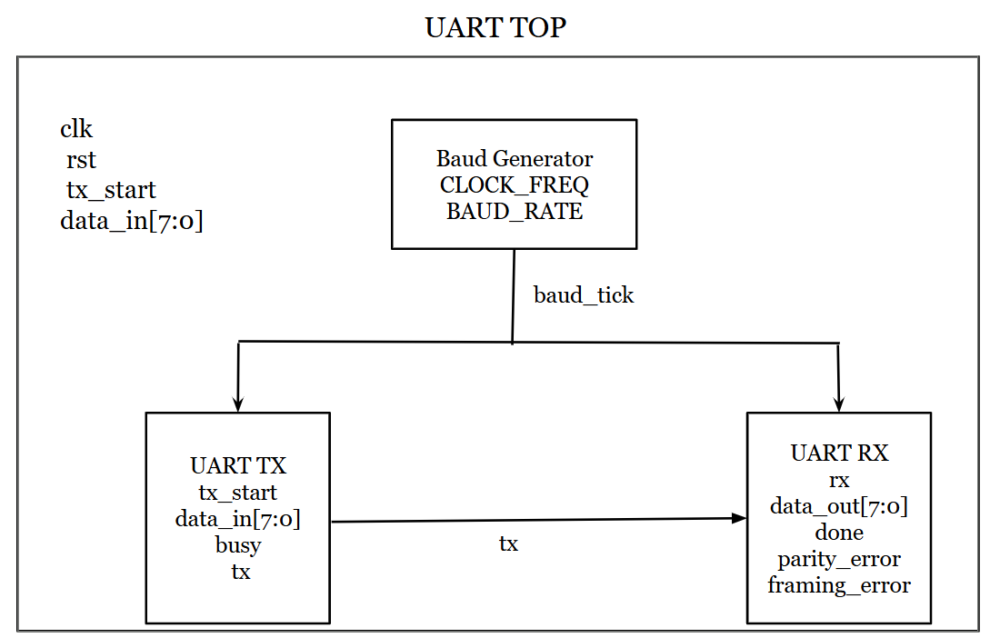

---

## Baud Generator

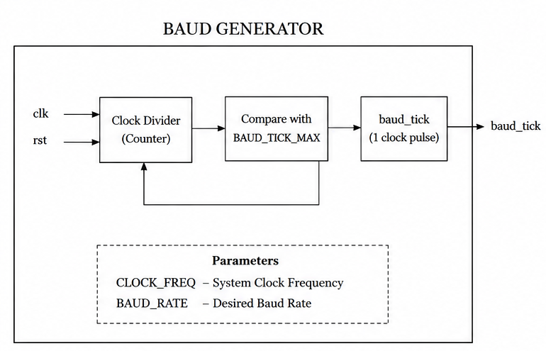

---

## UART Transmitter Architecture

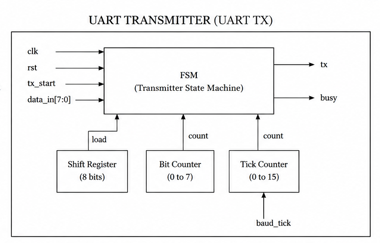

---

## UART Receiver Architecture

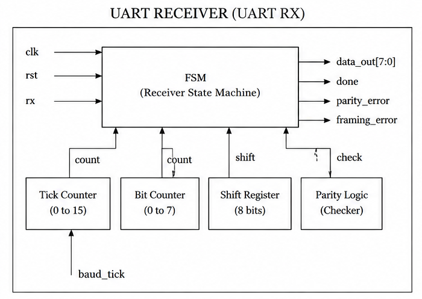

---

## FSM Diagrams

### UART Transmitter FSM

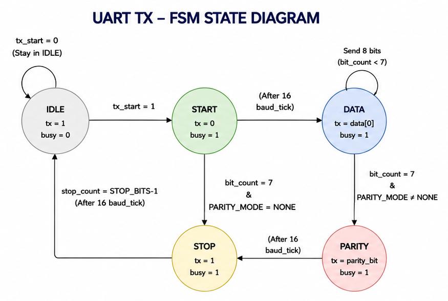

### UART Receiver FSM

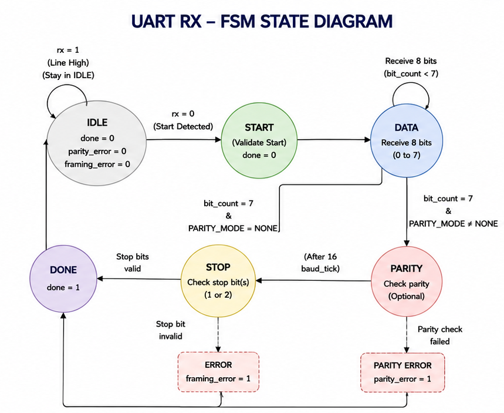

> **Note**
>
> The FSM diagrams illustrate the logical operation of the UART transmitter and receiver. The current implementation is configured for the verification setup used in this project while remaining extensible for additional UART features.

---

# Verification

The design was verified using a self-checking Verilog testbench.

### Verification Scenarios

- Basic Communication
- Busy Signal Validation
- Back-to-Back Frame Transmission
- Random Stress Testing

---

## Basic Communication

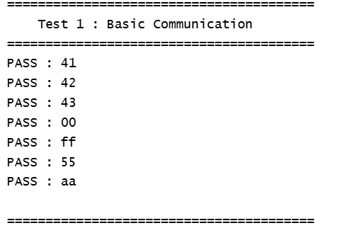

---

## Busy Signal

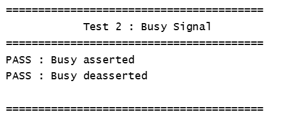

---

## Back-to-Back Frames

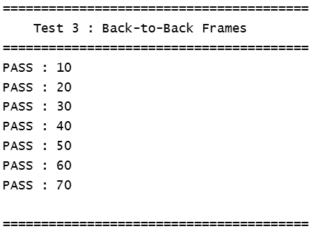

---

## Random Stress Test

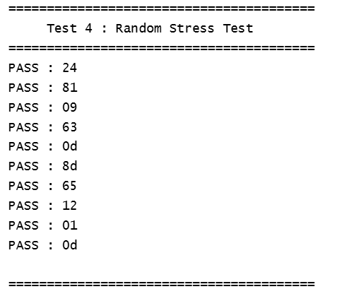

---

## Waveforms

### UART Waveform (Overview)

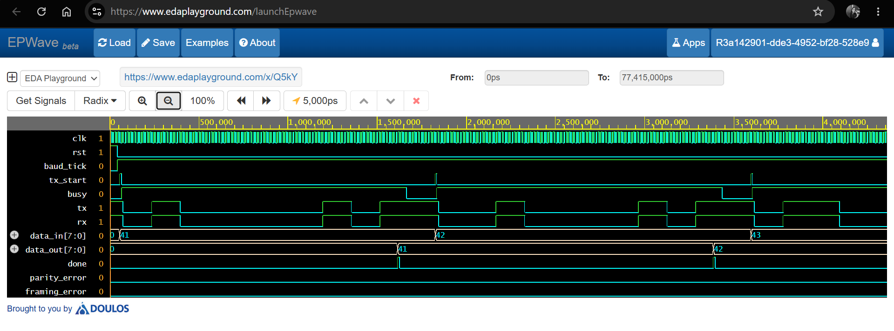

---

### UART Waveform (Zoomed)

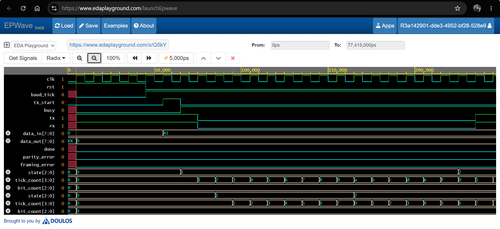

---

## Verification Summary

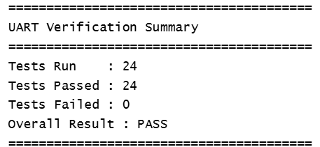

The complete verification log is available here:

📄 `docs/reports/verification_results.txt`

---

# Test Results

| Test | Status |
|------|--------|
| Basic Communication | ✅ PASS |
| Busy Signal | ✅ PASS |
| Back-to-Back Frames | ✅ PASS |
| Random Stress Test | ✅ PASS |

---

# Tools Used

- Verilog HDL
- Icarus Verilog
- EPWave
- EDA Playground

---

# Future Improvements

- Configurable Data Width
- FIFO Buffers
- Interrupt Support
- Hardware Synthesis Validation
- FPGA Implementation

---

# Author

**Beema Shahana Shiyad**

B.Tech Electronics and Communication Engineering
